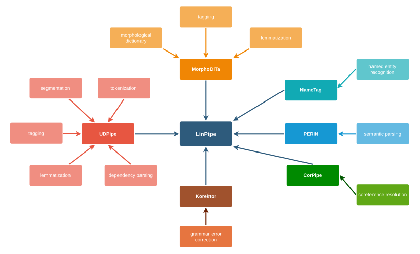

# LinPipe: Multilingual Processing Tool

LinPipe is a multilingual state-of-the-art text processing pipeline, currently
in preparation stage.

It is a natural evolution of popular and shared-task-winning tools like UDPipe,
NameTag, CorPipe, and MorphoDiTa. It provides seamless integration of various
subtasks of NLP processing, including tokenization, segmentation, POS tagging,
lemmatization, dependency parsing, semantic parsing, named entity recognition,
named entity linking, privacy filtering, coreference resolution, and others.

It provides easy to use and easy to deploy services for text processing,
supporting both on-site and server-side processing.

Stay tuned.
