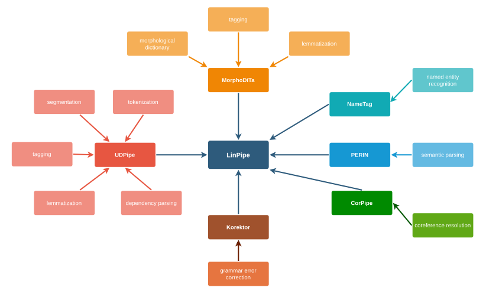

# LinPipe: Multilingual Processing Tool

**LinPipe** is a state-of-the-art multilingual text processing pipeline, currently under development.

It is the natural evolution of popular, shared-task-winning tools such as [UDPipe](https://ufal.mff.cuni.cz/udpipe), [NameTag](https://ufal.mff.cuni.cz/nametag), [CorPipe](https://github.com/ufal/corpipe), and [MorphoDiTa](https://ufal.mff.cuni.cz/morphodita). LinPipe seamlessly integrates a wide range of NLP tasks, including:

- tokenization and sentence segmentation,
- part-of-speech tagging and lemmatization,
- dependency parsing,
- semantic parsing,
- named entity recognition and linking,
- privacy filtering,
- coreference resolution,
- and more.

LinPipe is designed to be easy to use and easy to deploy, supporting both local (on-premises) and server-side processing.

*Stay tuned!*
