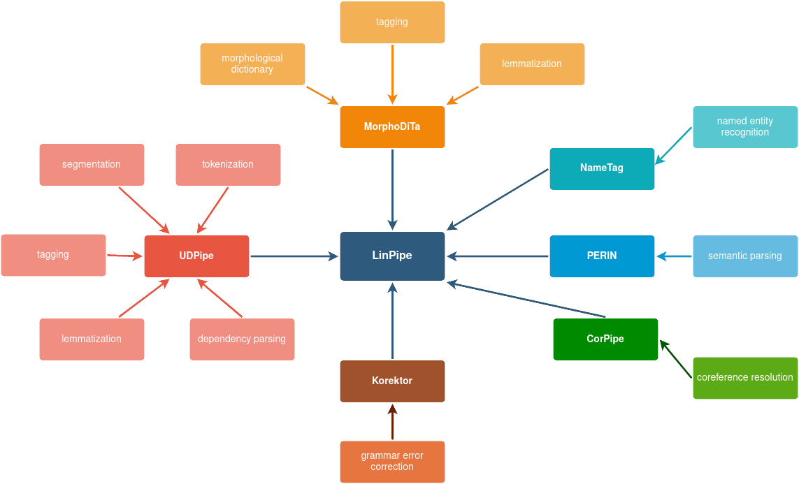

# LinPipe: Multilingual Processing Tool

LinPipe is a multilingual processing tool, currently in preparation stage.
It will contain the next generation of UDPipe, MorphoDiTa, NameTag, Korektor,
and other models.

Stay tuned.
