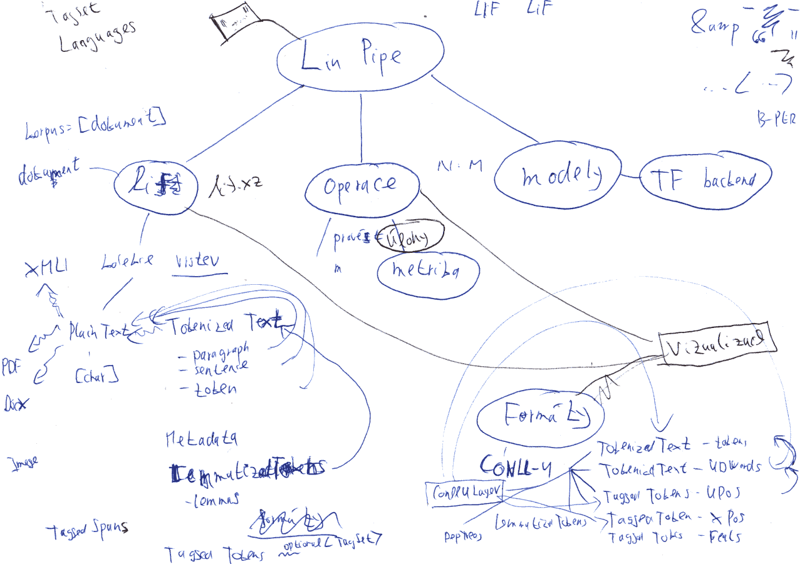

# Meeting Notes

### Commandline parameters

Operations start with `--`, followed by operation's subparameters (e.g.,
`batch_size`)

```
./linpipe --tag sth sth --parse sth sth
```

### Model names

achitecture-language(opt)-info-date

E.g.

```
NameTag2-cs-CNEC2.0-20220909
```

---


