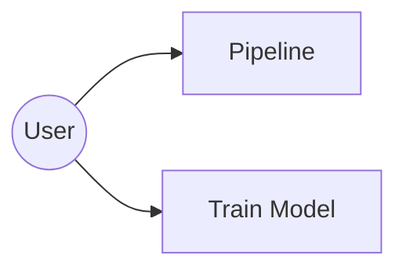
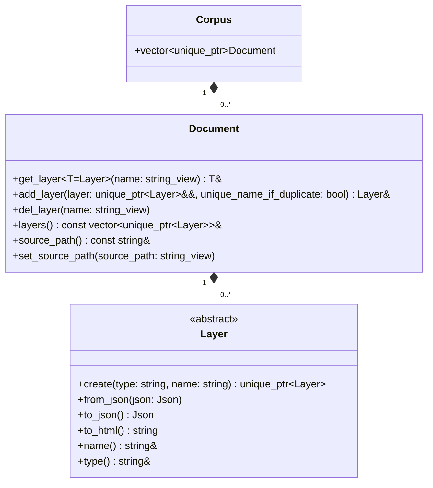
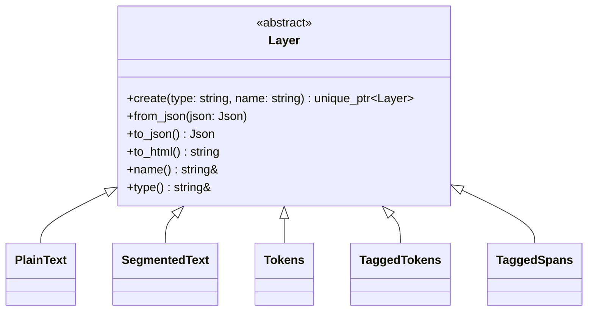
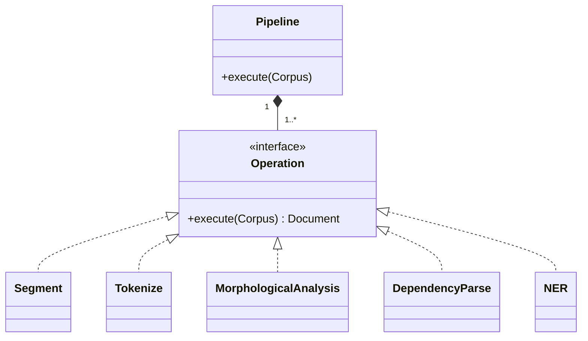
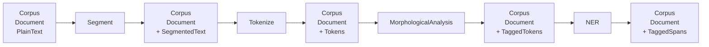

# System Architecture

## Overview

The system provides two main use cases:

- **Pipeline**: load a document, apply a configurable sequence of NLP
  operations, and write the resulting document.
- **Train model**: train a new model from available training data.



- **Data:** All data is held as a single `Corpus`, which contains a list of
  `Documents`, which contain a list of abstract `Layers`, such as `Text`,
  `SegmentedText`, `Tokens`, `TaggedTokens`, or `TaggedSpans`.
- **Pipeline**: The inference transformations execution is based on
  a `Pipeline`, a user-configured sequence of abstract `Operations`, such as
  `Segment`, `Tokenize`, or `Tag`.
- **Train model**: TODO.
- **I/O**: Input and output are realized via abstract `Formats`, such as LinPipe
  native `LiF`, `Text`, or `CoNLL`.

## Corpus, Document and Layers

A single `Corpus` serves as a container for a list of multiple `Documents`.
A `Document` is a collection of `Layers`. `Layers` are pure data structures. The
`Document` guarantees that layer names are unique. A `Document` may contain
several `Layers` of the same type, but the `Layer` names must be unique.



Typical `Layer` types include:



## Pipeline and Operations

All pipelines in LinPipe are realized via a user-configurable sequence of
transformations over data. A `Pipeline` consists of a configurable sequence of
`Operations`.



The operations are executed sequentially. Each operation receives the Corpus
produced by the preceding operation and enriches it with additional Layers.

For example:



The sequence of Operations is not fixed. Different Pipelines may compose
different Operations in different orders, provided that their Layer requirements
are satisfied.

## Input and Output Formats

TODO

## Design Suggestions for the Next Meeting

### Pipeline Validation

A `Pipeline` should validate the compatibility of its `Operations` before
execution. For that, each `Operation` should implement `require()` (a set of
`Layer` types) and `produce()` (a set of `Layer` types).

```
flowchart LR
    T[Task] --> V[Validate operation sequence]

    V -->|valid| R[Run operations]
    V -->|invalid| E[Configuration error]

    R --> O1[Operation 1]
    O1 --> O2[Operation 2]
    O2 --> O3[Operation 3]
```

An operation may additionally verify its required Layers at runtime and raise
an exception if the Document does not contain them.

For example, `NER` may declare:

```
requires: Tokens
produces: TaggedSpans
```

while `Tokenize` may declare:

```
requires: SegmentedText
produces: Tokens
```

## Execute vs. Apply

Maybe we should rename `execute()` to `apply().

## Corpus

Do we need a single `Corpus` holder for multiple `Documents`?

---

{ width=100% }
