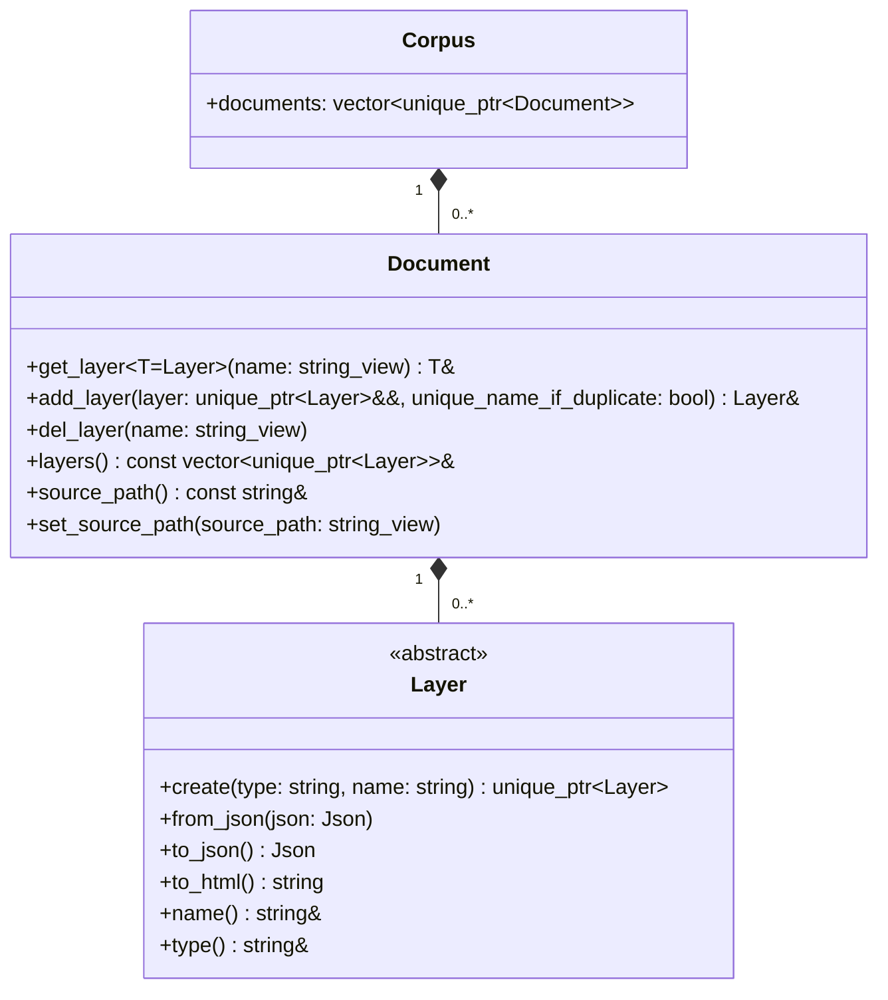
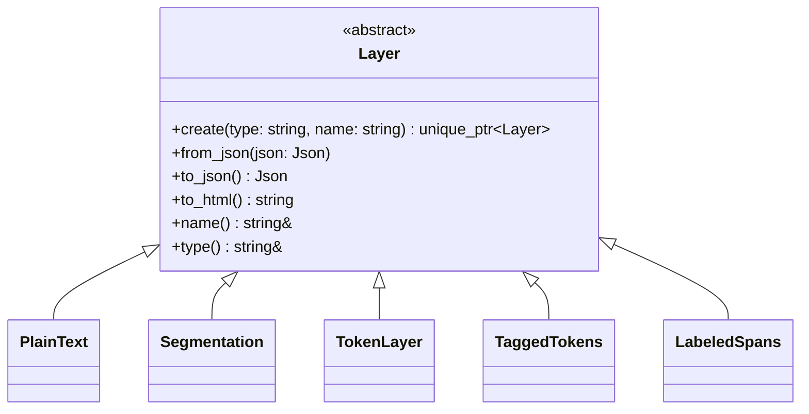
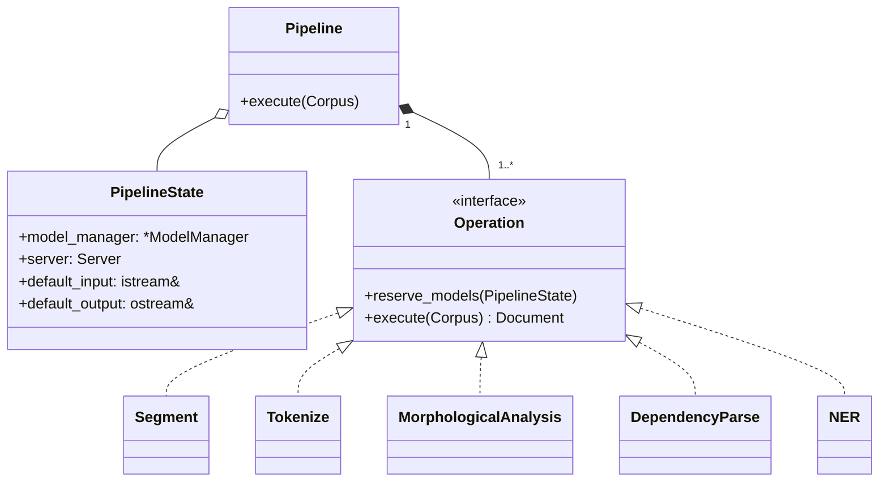
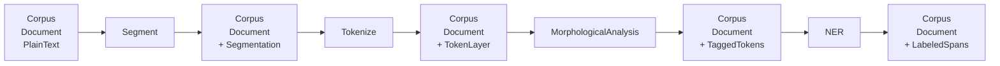
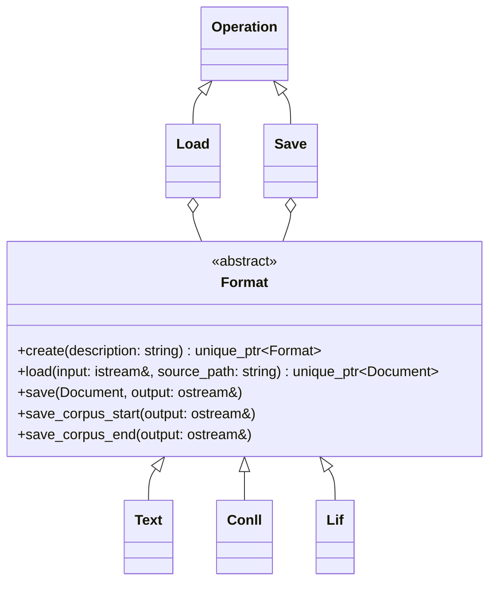
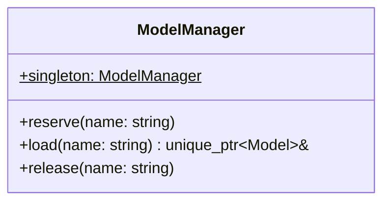
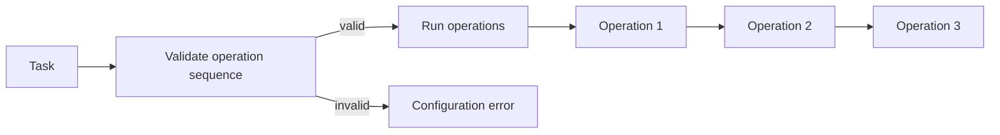

# System Architecture

## Overview

LinPipe is an NLP tool which loads an input, applies a configurable sequence of
NLP operations on it, and writes the resulting output.

An overview of the LinPipe system architecture:

- **Data:** All data is held as a single `Corpus`, which contains a list of
  `Documents`, which contain a list of abstract `Layers`, such as `PlainText`,
  `Segmentation`, `TokenLayer`, `TaggedTokens`, or `LabeledSpans`.
- **Pipeline**: The transformations execution is based on a `Pipeline`,
  a user-configured sequence of abstract `Operations`, such as `Segment` or
  `Tokenize`.
- **Formats**: `Load` and `Save` are also parts of the `Pipeline` as
  `Operations`, ones that contain an abstract class `Format`, such as `Text`,
  `Conll`, or `Lif`.
- **Model Management**: `ModelManager` singleton orchestrates loading local
  models from disk, access to models and unloading the models from memory.

## Corpus, Document and Layers

A single `Corpus` serves as a container for a list of multiple `Documents`.
A `Document` is a collection of `Layers`. `Layers` are pure data structures. The
`Document` guarantees that layer names are unique. A `Document` may contain
several `Layers` of the same type, but the `Layer` names must be unique.



Typical `Layer` types include:



## Pipeline and Operations

All pipelines in LinPipe are realized via a user-configurable sequence of
transformations over data. A `Pipeline` consists of a configurable sequence of
`Operations`.

The operations are executed sequentially. Each operation receives the `Corpus`
produced by the preceding operation and enriches it with additional `Layers`. The
operations also pass a `PipelineState` object which captures the `Pipeline`
instance information, in particular (i) `ModelManager` for access to
locally available models, (ii) 'Server' for access to cloud-based models, and
(iii) input and output stream.



For example:



The sequence of `Operations` is not fixed. Different `Pipelines` may compose
different `Operations` in different orders, provided that their `Layer`
requirements are satisfied.

## Formats

`Load` and `Save` are also `Operations` and part of the `Pipeline`. Each
instance of `Load` and `Save` contains a `Format`, such as `Text`, `Conll`, or
`Lif`.



An example of a full pipeline including a reader and a writer:

```mermaid
flowchart LR
  I["Input<br/>Format"]
  Load["Load<br/>Input<br/>Format"]
  D0["Corpus<br/>Document<br/>PlainText"]
  S["Segment"]
  D1["Corpus<br/>Document<br/>+ Segmentation"]
  T["Tokenize"]
  D2["Corpus<br/>Document<br/>+ TokenLayer"]
  M["MorphologicalAnalysis"]
  D3["Corpus<br/>Document<br/>+ TaggedTokens"]
  N["NER"]
  D4["Corpus<br/>Document<br/>+ LabeledSpans"]
  Save["Save<br/>Output<br/>Format"]
  O["Output<br/>Format"]

  I --> Load --> D0
  D0 --> S --> D1
  D1 --> T --> D2
  D2 --> M --> D3
  D3 --> N --> D4
  D4 --> Save --> O
```



For formats like `Conll` that already supply sentence and token boundaries
jointly, `Load` may construct `PlainText` (synthesized, per
`segmentation_tokenization.md`), `Segmentation`, and `TokenLayer` directly in
one pass, rather than needing `Segment` and `Tokenize` to run afterward.

## Model Management

A `ModelManager` singleton orchestrates local models loading upon creation of
the `Pipeline` based on model reservation requests from the individual
`Operations` and handles releasing the models from the memory once there is no
`Operation` to consume the model in the future.



## Training Models for LinPipe

LinPipe in C++ only handles the inference.

Model training for LinPipe will be implemented as Python binding for the C++
code over the I/O and batching C++ implementatins, and exposed to Python via
Python binding `linpipe.training`. The training itself will be freely
implemented in Python scripts using `import linpipe.training`. Trained
checkpoints are saved in `onnx`. `ModelManager` also loads trained checkpoints
via `onnx`.

## Design Suggestions for the Next Meeting

### Pipeline Validation

A `Pipeline` should validate the compatibility of its `Operations` before
execution. For that, each `Operation` should implement `require()` (a set of
`Layer` types) and `produce()` (a set of `Layer` types).



An operation should additionally verify its required `Layers` at runtime and raise
an exception if the `Document` does not contain them.

For example, `NER` may declare:

```
requires: TokenLayer
produces: LabeledSpans
```

while `Segment` and `Tokenize` may declare:

```
requires: PlainText
produces: Segmentation
```

```
requires: PlainText, Segmentation
produces: TokenLayer
```

### Execute vs. Apply

Maybe we should rename `execute()` to `apply()`.

---

{ width=100% }
