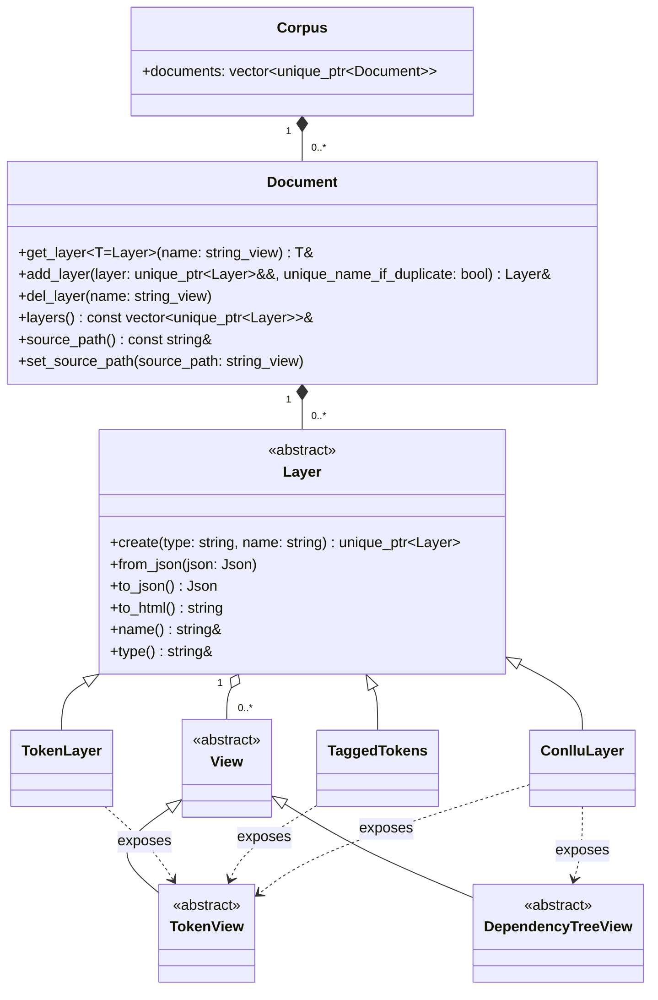
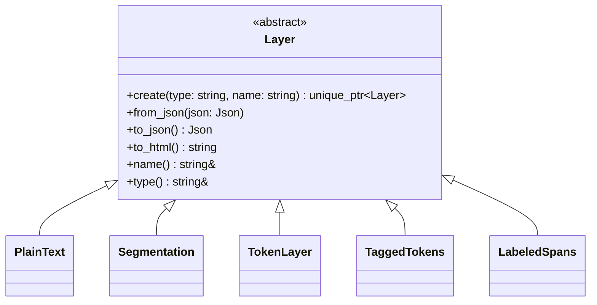
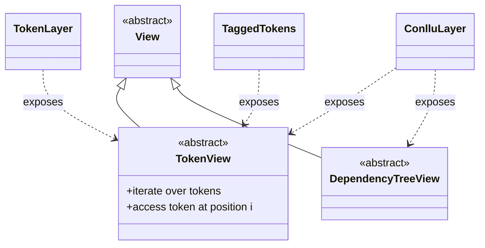
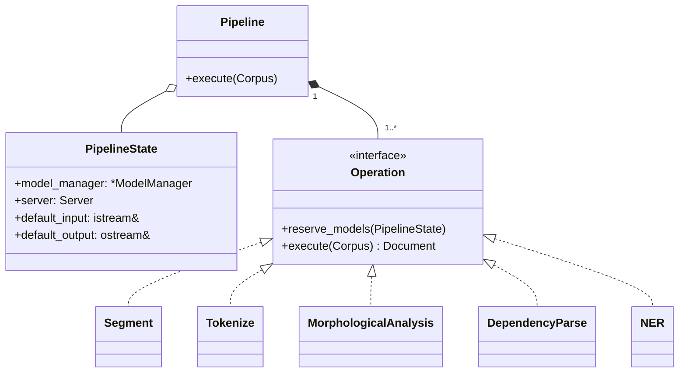
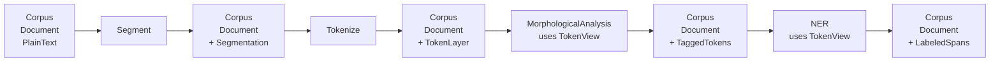
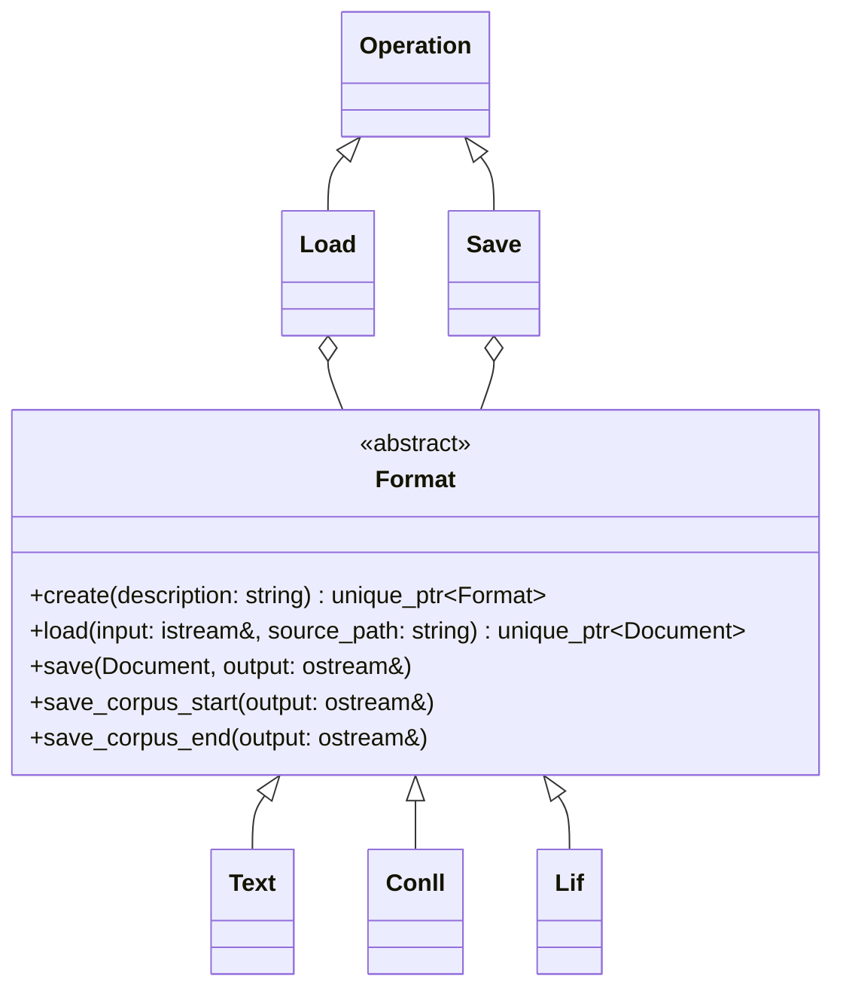
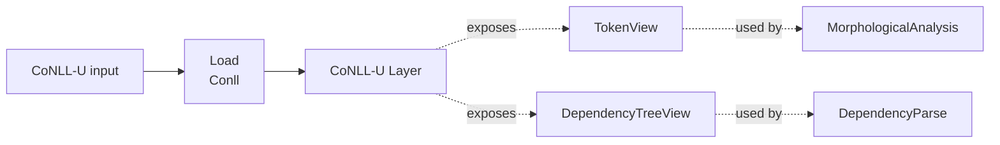
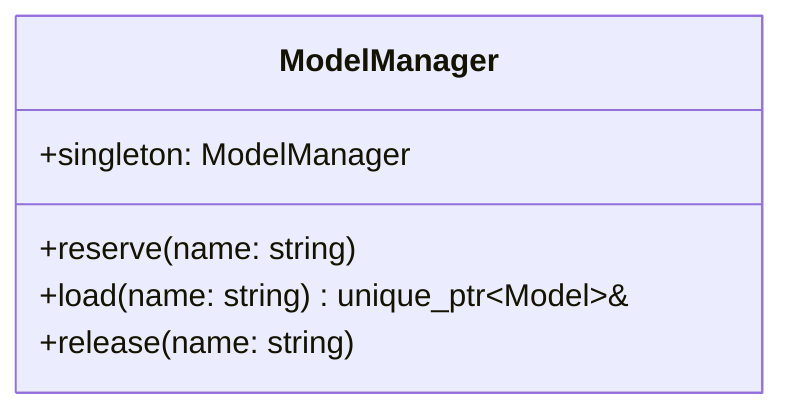
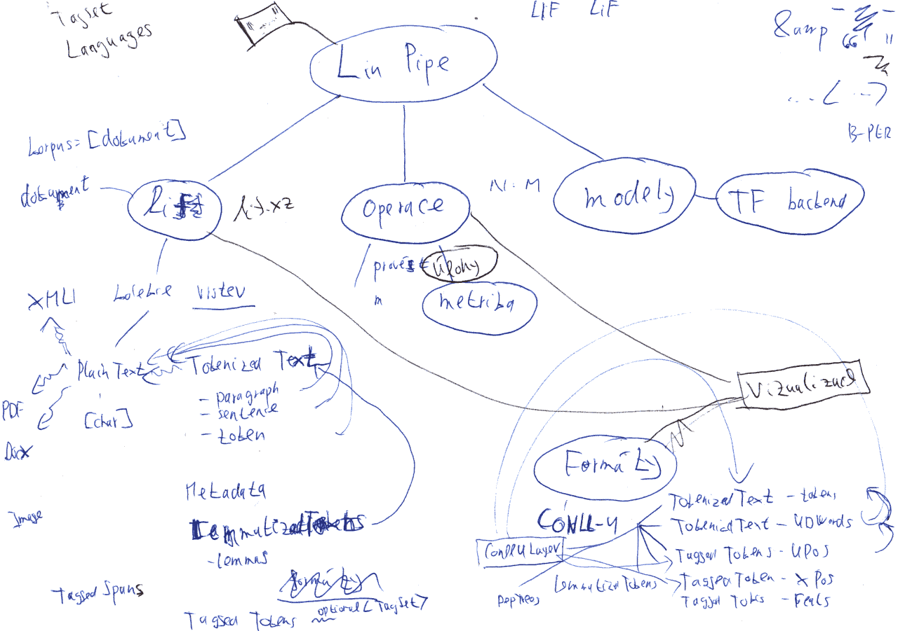

# System Architecture

## Overview

LinPipe is an NLP tool which loads an input, applies a configurable sequence of
NLP operations on it, and writes the resulting output.

An overview of the LinPipe system architecture:

- **Data:** All data is held as a single `Corpus`, which contains a list of
  `Documents`, which contain a list of abstract `Layers`, such as `PlainText`,
  `Segmentation`, `TokenLayer`, `TaggedTokens`, or `LabeledSpans`.
- **Views:** `Layers` expose the stored data using `Views`: an abstract
  hierarchy of classes providing a unified API (e.g., `TokenView`: iteration over
  tokens, accessing a token at position `i`), with specialized implementations for
  different `Layers`. A `Layer` can expose multiple `Views` (e.g., a `CoNLL-U`
  layer may expose both `TokenView` and `DependencyTreeView`).
- **Pipeline**: The transformations execution is based on a `Pipeline`,
  a user-configured sequence of abstract `Operations`, such as `Segment` or
  `Tokenize`.
- **Formats**: `Load` and `Save` are also parts of the `Pipeline` as
  `Operations`, ones that contain an abstract class `Format`, such as `Text`,
  `Conll`, or `Lif`.
- **Model Management**: `ModelManager` singleton orchestrates loading local
  models from disk, access to models and unloading the models from memory.

In short:

- `Layers` store data.
- `Views` provide a uniform API for accessing/interpreting that data.
- A `Layer` can provide zero, one, or several `Views`.
- Different `Layer` implementations can provide the same `View` API.
- `Operations` still consume/produce `Layers`; `Views` are how they access the
  contents of those `Layers`.

## Corpus, Document, Layers and Views

A single `Corpus` serves as a container for a list of multiple `Documents`.
A `Document` is a collection of `Layers`. `Layers` are pure data structures. The
`Document` guarantees that layer names are unique. A `Document` may contain
several `Layers` of the same type, but the `Layer` names must be unique.

`Layers` expose their stored data through `Views`. A `View` provides a unified
API for accessing a particular kind of linguistic information, independently of
the underlying `Layer` representation. For example, a `TokenView` provides
iteration over tokens and access to a token at a given position.

A `Layer` may expose multiple `Views`. For example, a `CoNLL-U` layer may expose
both a `TokenView` and a `DependencyTreeView`. Conversely, the same `View` type
may be implemented by different `Layer` types.

The distinction between `Layers` and `Views` is important because linguistic
structures do not always correspond to simple, independent data types.
Representing all such distinctions directly in the `Layer` hierarchy would lead
to an unnecessarily large number of specialized classes. `Views` avoid this
class explosion by separating the stored representation from the way its
linguistic content is accessed, allowing operations to work with the linguistic
abstraction they require without depending on the concrete `Layer`
representation.

Typical `Layer` types include:

The `View` hierarchy provides unified APIs for accessing data exposed by
different `Layers`. For example:

A `Layer` is therefore not tied to a single way of accessing its data. For
example, a `CoNLL-U` layer can expose both token-level and dependency-tree
information through separate `Views`.

## Pipeline and Operations

All pipelines in LinPipe are realized via a user-configurable sequence of
transformations over data. A `Pipeline` consists of a configurable sequence of
`Operations`.

The operations are executed sequentially. Each operation receives the `Corpus`
produced by the preceding operation and enriches it with additional `Layers`.
Operations access the contents of `Layers` through their corresponding `Views`,
rather than depending on a particular `Layer` representation.

The operations also pass a `PipelineState` object which captures the `Pipeline`
instance information, in particular (i) `ModelManager` for access to
locally available models, (ii) 'Server' for access to cloud-based models, and
(iii) input and output stream.

For example:

The sequence of `Operations` is not fixed. Different `Pipelines` may compose
different `Operations` in different orders, provided that their `Layer`
requirements are satisfied.

## Formats

`Load` and `Save` are also `Operations` and part of the `Pipeline`. Each
instance of `Load` and `Save` contains a `Format`, such as `Text`, `Conll`, or
`Lif`.

An example of a full pipeline including a reader and a writer:

```mermaid
flowchart LR
  I["Input<br/>Format"]
  Load["Load<br/>Input<br/>Format"]
  D0["Corpus<br/>Document<br/>PlainText"]
  S["Segment"]
  D1["Corpus<br/>Document<br/>+ Segmentation"]
  T["Tokenize"]
  D2["Corpus<br/>Document<br/>+ TokenLayer"]
  M["MorphologicalAnalysis"]
  D3["Corpus<br/>Document<br/>+ TaggedTokens"]
  N["NER"]
  D4["Corpus<br/>Document<br/>+ LabeledSpans"]
  Save["Save<br/>Output<br/>Format"]
  O["Output<br/>Format"]

  I --> Load --> D0
  D0 --> S --> D1
  D1 --> T --> D2
  D2 --> M --> D3
  D3 --> N --> D4
  D4 --> Save --> O
```

For formats like `Conll` that already supply sentence and token boundaries
jointly, `Load` may construct `PlainText` (synthesized, per
`segmentation_tokenization.md`), `Segmentation`, and `TokenLayer` directly in
one pass, rather than needing `Segment` and `Tokenize` to run afterward.

A format may also provide a `Layer` that exposes multiple `Views`. For example,
a `CoNLL-U` layer may expose both a `TokenView` and a `DependencyTreeView`, which
can then be used independently by operations requiring token-level or
dependency-tree access.

## Model Management

A `ModelManager` singleton orchestrates local models loading upon creation of
the `Pipeline` based on model reservation requests from the individual
`Operations` and handles releasing the models from the memory once there is no
`Operation` to consume the model in the future.

## Training Models for LinPipe

LinPipe in C++ only handles the inference.

Model training for LinPipe will be implemented as Python binding for the C++
code over the I/O and batching C++ implementatins, and exposed to Python via
Python binding `linpipe.training`. The training itself will be freely
implemented in Python scripts using `import linpipe.training`. Trained
checkpoints are saved in `onnx`. `ModelManager` also loads trained checkpoints
via `onnx`.

---

{ width=100% }
