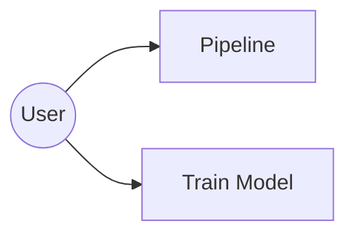
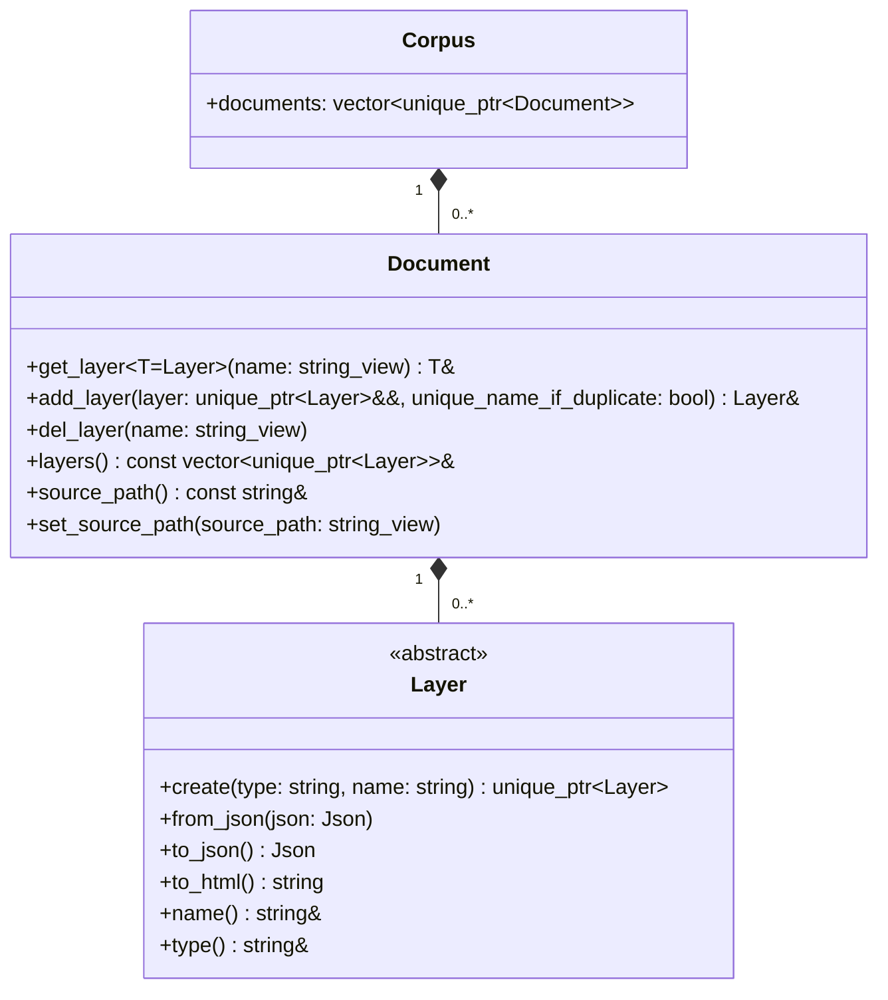
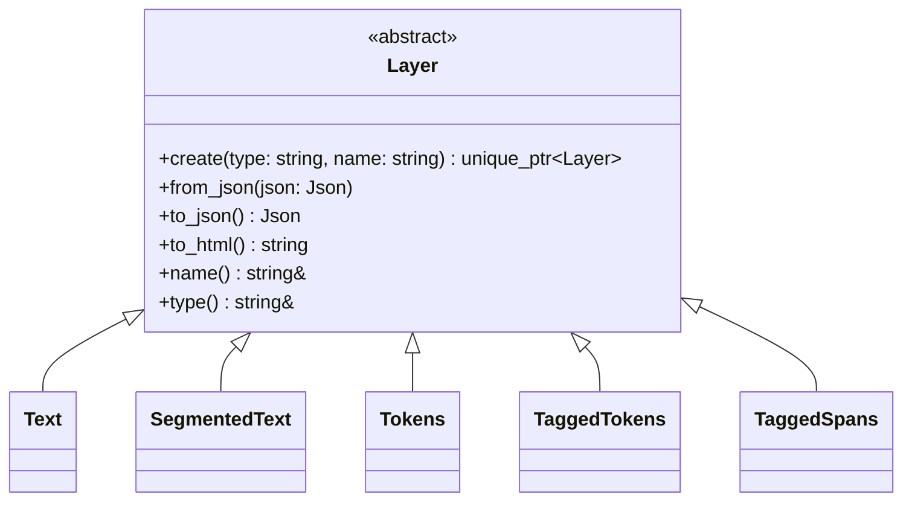
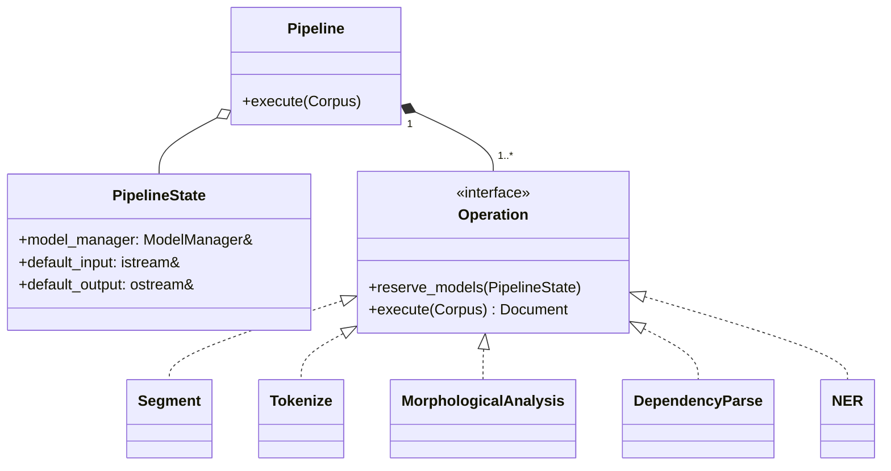
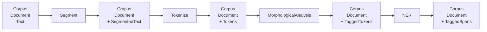
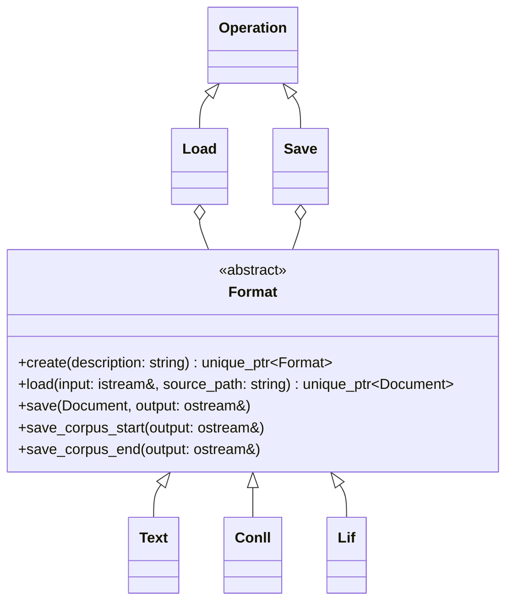
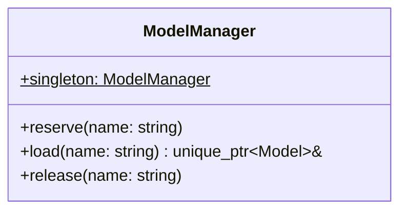
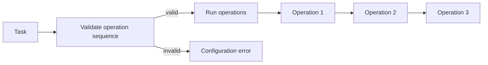

# System Architecture

## Overview

The system provides two main use cases:

- **Pipeline**: load a document, apply a configurable sequence of NLP
  operations, and write the resulting document.
- **Train model**: train a new model from available training data.



An overview of the LinPipe system architecture:

- **Data:** All data is held as a single `Corpus`, which contains a list of
  `Documents`, which contain a list of abstract `Layers`, such as `Text`,
  `SegmentedText`, `Tokens`, `TaggedTokens`, or `TaggedSpans`.
- **Pipeline**: The inference transformations execution is based on
  a `Pipeline`, a user-configured sequence of abstract `Operations`, such as
  `Segment` or `Tokenize`.
- **I/O**: `Load` and `Save` are also parts of the `Pipeline` as `Operations`,
  ones that contain an abstract class `Format`, such as `Text`, `Conll`, or
  `Lif`.
- **Train model**: Python binding for the C++ code with I/O and batching
  implemented in C++, shared with the `Pipeline` use case, and exposed to Python
  via Python binding `linpipe.training`. The training itself implemented in
  Python scripts with `import linpipe.training`. Trained checkpoints saved in
  `onnx`. `ModelManager` loads trained checkpoints via `onnx`.
- **Model Management**: `Model Manager` orchestrates loading models from disk,
  access to models and rotating the models in memory.

## Corpus, Document and Layers

A single `Corpus` serves as a container for a list of multiple `Documents`.
A `Document` is a collection of `Layers`. `Layers` are pure data structures. The
`Document` guarantees that layer names are unique. A `Document` may contain
several `Layers` of the same type, but the `Layer` names must be unique.



Typical `Layer` types include:



## Pipeline and Operations

All pipelines in LinPipe are realized via a user-configurable sequence of
transformations over data. A `Pipeline` consists of a configurable sequence of
`Operations`.

The operations are executed sequentially. Each operation receives the Corpus
produced by the preceding operation and enriches it with additional Layers. The
operations also pass a `PipelineState` object which captures the `Pipeline`
instance information, in particular the pointer to `Model Manager` for access to
available models and input and output stream.



For example:



The sequence of Operations is not fixed. Different Pipelines may compose
different Operations in different orders, provided that their Layer requirements
are satisfied.

## Formats

`Load` and `Save` are also `Operations` and part of the `Pipeline`. Each
instance of `Load` and `Save` contains a `Format`, such as `Text`, `Conll`, or
`Lif`.



## Model Management



## Design Suggestions for the Next Meeting

### Pipeline Validation

A `Pipeline` should validate the compatibility of its `Operations` before
execution. For that, each `Operation` should implement `require()` (a set of
`Layer` types) and `produce()` (a set of `Layer` types).



An operation may additionally verify its required Layers at runtime and raise
an exception if the Document does not contain them.

For example, `NER` may declare:

```
requires: Tokens
produces: TaggedSpans
```

while `Tokenize` may declare:

```
requires: SegmentedText
produces: Tokens
```

### Execute vs. Apply

Maybe we should rename `execute()` to `apply()`.

### Corpus

Do we need a single `Corpus` holder for multiple `Documents`?

### Server in PipelineState

Source code has `Server server` in `PipelineState`, why are we passing a server
along with a Pipeline?

### Train Model

Class design.

## TODO

1. Describe pipeline construction from string description.
2. Describe I/O.

---

{ width=100% }
