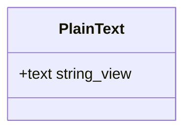
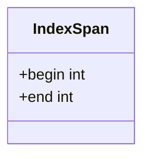
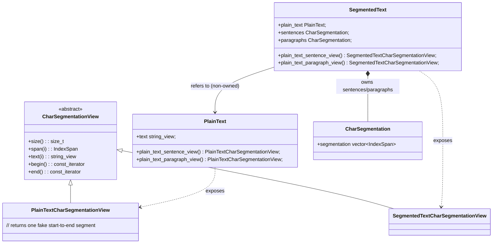
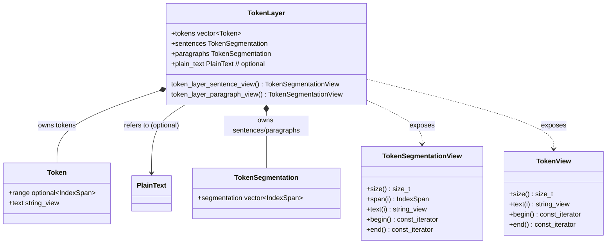

# Segmentation and Tokenization

## Design Requirements

- Underlying plain text may or may not be available.
- Tokens may be character-anchored to plain text if available, or they may just
  exist independently of the underlying plain text without character backup.
- Even for a character-anchored token, a token's text isn't necessarily the
  literal substring at its own span (e.g., Unicode normalization).
- A run of tokens may be a syntactic decomposition of one literal surface unit,
  as with CoNLL-U multiword tokens (e.g. "zum" -> "zu" + "dem", neither of which
  occurs verbatim in the source, nor has its own independent span). For this
  reason, a token-like layer may have to derive it's content from another
  token-like layer, with additional complexity over it.
- Avoid hard copying the string representations to save memory to be able to
  scale to large corporas.
- Tokens, their overrides and the multiword tokens may be produced once either
  by reading from a file (e.g., a `Load` operation with a `CoNLL-U` format), or
  gradually by a sequence of operations (e.g., `Tokenize`).
- All token-like layers must express a token iterator, an accessor to the i-th
  token text and a `size_t` (number of tokens) method.
- Segmentation is (typically sentence segmentation) can exist and without
  tokenization, i.e, when loading line-separated sentences of raw text.
- In other contexts, segmentation is understood as segmentation of tokens.
- For these reasons, Segmentation can either be expressed a sequence of
  non-overlapping character spans into the underlying plain text, or it can be
  expressed as indices into a token-like layer, where it marks the segment
  boundaries.
- The consumers further the processing pipeline may request a view over
  sentence-delimited tokens.

## PlainText

`PlainText` layer represents the original plain text where existing.

As these text may be very large in large corpora, we avoid copying this content
and refer to this layer whenever possible in the further design.

### IndexSpan

As a prerequisity to marking spans, we introduce `IndexSpan`:

## Segmentation

In linguistics, sentence segmentation is usually used in an abstract way as
"something that is segmented into sentences". However, we need to distinguish,
both logically and structually, between:

- `CharSegmentation`: character-based sentence segmentation, in which
  indices refer to characters anchored in plain text,
- `TokenSegmentation`: token-based sentence segmentation, in which indices refer
  to tokens.

Moreover, many linguistic layers may express either of these view based on their
type and content, so we are also going to have two types of `Views`:

- `CharSegmentationView`: a vector of character-based `IndexSpans` into
  a `PlainText`.
- `TokenSegmentationView`: a vector of token-based `IndexSpans` into
  a `TokenLayer`.

## Tokens

A `Token` may either be constructed by a character anchor into an underlying
`PlainText` using `IndexSpan`, with additional text overrides (such as
normalization), or it may be directly constructed from an already segmented and
tokenized text by a `Load` operation (e.g., using a `CoNLL-U` format).

