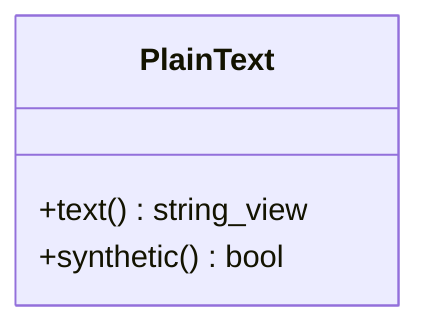
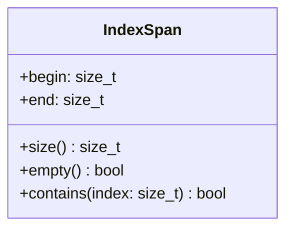
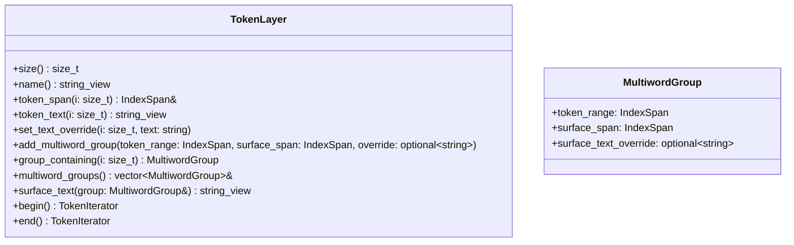

# Segmentation and Tokenization

`PlainText` is mandatory: for corpora with real source text this is the actual
document text; for corpora loaded pre-tokenized (e.g. `CoNLL`, where no original
text ever existed) the `Load` operation must synthesize one and mark it
`PlainText::synthetic()`.

Either way, `TokenLayer` itself never stores a copy of
token characters; it always reads them out of the referenced `PlainText`, which
keeps per-token memory to a single `IndexSpan` (two integers) rather than
a duplicated string, for scaling to large corpora.

`TokenLayer` is always backed up with mandatory `PlainText` on character level.
However, just keeping `IndexSpans` into `PlainText` is not sufficient, as we
have to deal with cases that plain `IndexSpan` can't express:

1. A token's text isn't the literal substring at its own span (Unicode 32
   normalization).
2. A run of tokens is the syntactic decomposition of one literal surface unit,
   as with CoNLL-U multiword tokens (e.g. "zum" -> "zu" + "dem", neither of
   which occurs verbatim in the source, nor has its own independent span).

Therefore, `TokenLayer` internally manages three data structures:

1. `vector<IndexSpans> spans_`: the actual spans into `PlainText`,
2. `unordered_map<size_t, string> overrides_`: for overrides over the original `PlainText` surface tokens,
3. `vector<MultiwordGroup> multiword_groups_`: multiword groups.

Then for token at position `i`, `token_text(i)` returns an explicit override if
one was previously saved for `i` into `overrides_` with `set_text_override()`,
otherwise the literal substring of the referenced `PlainText`.

Accessing the original surface text with multiwords, for example as a `CoNLL-U`
writer: The client walks the token stream (`begin()->end()`) alongside the
multiword groups (`multiword_groups()`) to know where to emit a surface line
before its constituent word lines.

